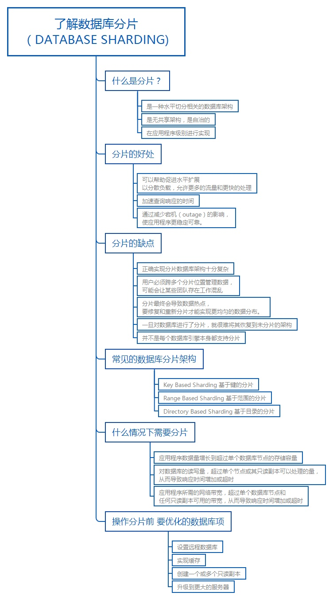
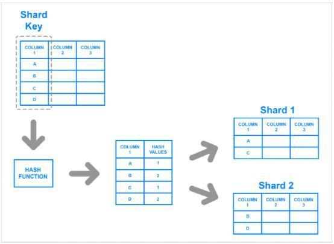
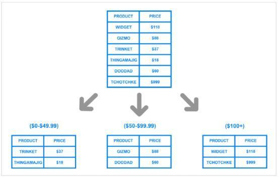

## 1.分片定义

水平分片（也叫水平分库）指的是将整体存储在单个数据库中的数据，通过某种策略分摊到多个表结构与其相同的数据库中，这样每个数据库中的数据量就会相对减少很多，并且可以部署在不同物理服务器上，理论上能够实现数据库的无限横向拓展。所以水平分片是数据库性能问题的最终解决方案。

通常，分片（Sharding）在应用程序级别进行实现。这意味着应用程序包含“要向哪个分片发送读和写”的代码。但是，某些数据库管理系统内置了分片功能，允许您直接在数据库级别实现分片。



### 1.1 分片的优缺点

**优点：**

使架构扩展性更强，分散负载

加速查询响应的时间

减少宕机的影响，分片数据库宕机，即使可能使某些用户无法使用应用程序或网站部分功能，但仍会低于整个数据库崩溃带来的影响

**缺点：**

复杂，协同工作引发工作混乱

分片会超出预期变得不平衡

分片后很难恢复未分片的架构

对于不支持分片的数据库需要自己动手实现，可查询的文档较少

## 2.分片场景

**数据量变大时候，我们进行分库分表**

分库：对数据库进行垂直分库，将业务彼此无关的表放在单独的数据库中，分库后不同库中的表无法进行联合查询等操作，但是可以平摊压力，并且独立做读写分离。

分表：对数据库进行水平分表，建立多个结构相同的表分摊数据，使得每个表的数据量减少从而提升速度。分表和最开始提到的数据库分片看起来很像，实际各有优劣：分表后各个子表还是可以通过 union 等命令联合查询，分库后则不行。但是分库后每个数据库可以独立部署在不同的服务器上，充分利用多台服务器的性能，分表却只能在单台机器的单个数据库上，如果是服务器本身的性能达到瓶颈，则分表不会有明显作用。

**分片之前需要考虑的优化**

分片除非到达绝对必要，否则应该避免。

在分片之前，可以用以下方式进行优化：

1） 设置远程数据库，将数据库单服务从服务器独剥离出来

2） 实现缓存，

3） 创建一个/多个 只读副本，读写分离

4） 升级到更大的服务器

## 3.分片策略

1）基于 id 的区间分片，例如：将 id 为 1-2w 的数据存放在 A 数据库，2w-4w 的数据存放在 B 数据库。缺点是单库能承受的数据量需要预估，如果预估的不准确容易造成性能不够用或者浪费。

2）基于 id 的 hash 分片，例如：将 id%2=0 的数据存放在 A 数据库，id%2=1 的数据放在 B 数据库。

**缺点：** 是在动态增加/删除数据库时，hash 的结果会发生变化，所以需要对已有数据进行迁移，一般是用一致性 hash 或在分库初期就建立足够的数据库避免这个问题。

**优点：** 均匀分布数据，防止热点，以算法分配数据，无需维护所有数据所在位置的映射。



3）基于时间的区间分片，大部分软件都会有一个特征：越新的数据被操作的几率越大，老数据几乎不会被操作。所以通过数据的插入时间进行分库（也称为冷热分离），例如：将 2015年1月-5月 的数据放在一个库，6月 到 12月 的数据放在另一个库。这样做的缺点是在查询时需要额外提供数据的创建时间才能找到数据存放在哪个库，所以比较适合微博等主要以时间轴（Timeline）功能为主的软件。

4）基于检索表分片，通过额外建立一张检索表保存 id 与所在数据库节点的对应关系，优点是逻辑简单，自由且不会有迁移问题，缺点是每次查询都需要额外查询检索表，所以一般会选择将检索表缓存到内存中。

5）基于地理位置分片，像点评、滴滴打车之类的软件由于不同城市的数据不需要互通，可以按照城市分片，将不同城市的数据存放在不同数据库中，这样做的一个优点是可以将数据库服务器部署到离对应城市最近的节点上，以提高访问速度。

6) 基于范围的分片，基于给定值的范围进行数据分片

**缺点：** 不能预防数据不均匀的现象

**优点：** 简单




## 4.基于id的hash分片遇到的问题

### 4.1 遍历表
单表模式的遍历查询为：
微博表结构如下：
```
create table weibo(
    id int primary key auto_increment comment '主键',
    user_id int comment '发微博的用户id',
    create_at datetime comment '创建时间',
    ...
) comment '微博';
```
单库情况下查询当前20条微博的sql：
```
select * from weibo order by create_at desc limit 20;
```
分库情况下sql：
```
select * from db_1.weibo order by create_at desc limit 20;
select * from db_2.weibo order by create_at desc limit 20;
select * from db_3.weibo order by create_at desc limit 20;
select * from db_4.weibo order by create_at desc limit 20;
...
```
需要将所有库的最新 20 条都查询出来排序后再取出总的最新 20 条。

如果改成需要查询当前最新的第 20-40 条微博的话，单库的 SQL 语句为：
```
select * from weibo order by create_at desc limit 20, 20;
```
分库的sql为：
```
select * from db_1.weibo order by create_at desc limit 40;
select * from db_2.weibo order by create_at desc limit 40;
select * from db_3.weibo order by create_at desc limit 40;
select * from db_4.weibo order by create_at desc limit 40;
```
注意这里取出的就不是20-40了。以此类推，如果需要查询15000-15020条微博的话，查询的效率肯定是无法忍受的。
解决办法就是在额外建立一张索引表，保存id和排序，筛选字段，先从索引表中查询对应的id，再通过id去查询具体信息。索引表如果不复杂的话，可以通过redis的zset和list实现。

### 4.2 主键冲突
单表的时候，大多数是把主键设置为auto_increment，但是auto_increment是和表绑定的，所以在分库后每个表的自增id也是独立的，这时候发生的主键冲突，解决办法以下：

1）.使用公用id生成器，通过redis的incr生成id，或者在mysql中建立一张表用于生成id

2）.如果预先分配好了数据库的个数，我们可以对每个库中的表设定步长和初始值
```
SET @@auto_increment_increment=36;
use db_1;
alter table weibo auto_increment=1;

use db_2;
alter table weibo auto_increment=2;
...
```
这样 db\_1 的自增 id 就会变成 1, 37, 73…，db\_2 的自增 id 就会变成 2, 38, 74…，只要保证不会改变数据库的个数，id 就肯定不会冲突。

3).使用uuid保持一致

4).自己实现一个id生成算法，使用unix时间戳保持有序，混入mac地址等保证唯一

### 4.3 禁止联合查询
用户表和关注关系表 表结构：
```
create table user (
    id int primary key auto_increment comment '主键',
    sex tinyint comment '性别:0 女,1 男'
    ...其他字段
) comment '用户';

create table follow (
    user_id int comment '用户 id',
    follow_id int comment '关注的用户 id',
    ...其他字段
) comment '关注关系';
```
单表模式下，查询用户1都关注了谁的sql：
```
select * from user u inner join follow f on f.follow_id = u.user_id where f.user_id = 1;
```
但是在分库情况下不同,sql需要查询两次，先从关联的表中查询出符合条件的 id，在根据 id 去对应的数据库里查询主体信息。
```
ids = 
select follow_id from follow where user_id = 1;

use db_1;
select * from user where id in (ids);

use db_2;
select * from user where id in (ids);
...

```
### 4.4 关联表的冗余字段
刚刚的需求变更了，需要查询用户1关注的所有男性用户，并且以每页20条进行分页，单库的sql语句为：
```
select * from user u innner join follow f on f.follow_id = u.user_id where f.user_id = 1 and u.sex =1 limit 20
```
多库的sql：
```
ids=
select follow_id from follow where user_id =1 limit 20;

use db_1;
select * from user where id in(ids) and sex = 1;

use db_2;
select * from user where id in(ids) and sex = 1;

...
```
看上去没啥问题，但是最后查询量却达不到分页量，因为正常的逻辑是筛选是在分页前的，但是这里确是先分页后筛选，所以出现数据量不够的情况。解决办法是在follow表中冗余user的sex字段，直接在第一次查询的时候就完成筛选和分页，这样就需要在user的sex字段发生变更时动态更新follow表中的sex字段。

### 4.5 关联表的冗余表


### 4.6 分布式事务


## 相关参考


https://www.scienjus.com/database-sharding-review/  数据库水平分片心得

https://zhuanlan.zhihu.com/p/57185574  数据库分片详解


