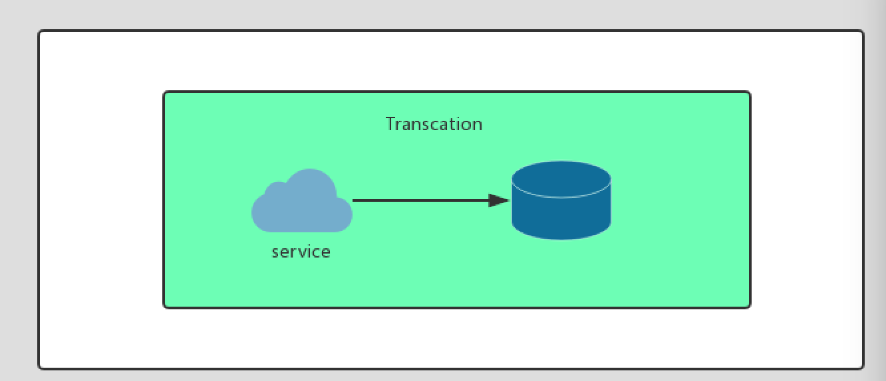
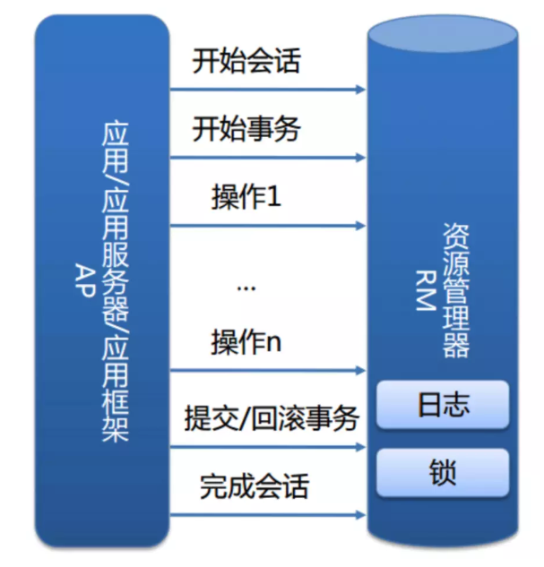
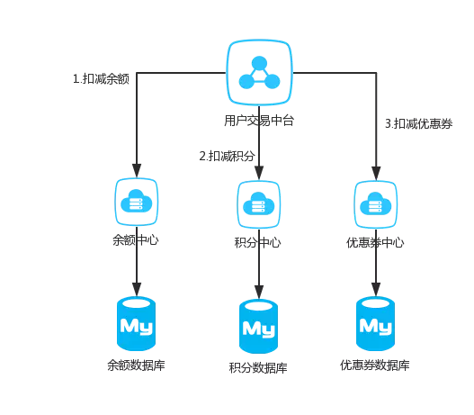
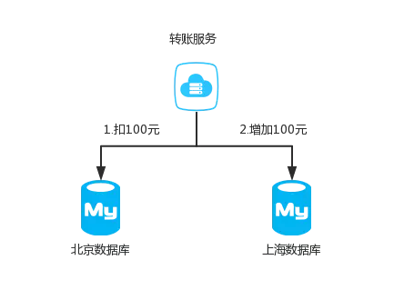
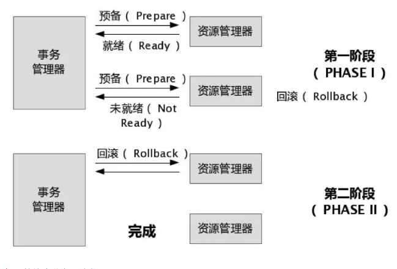
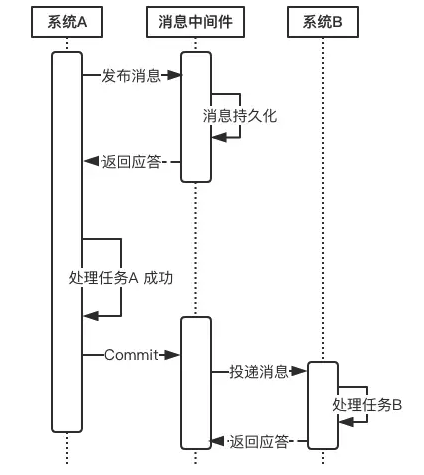
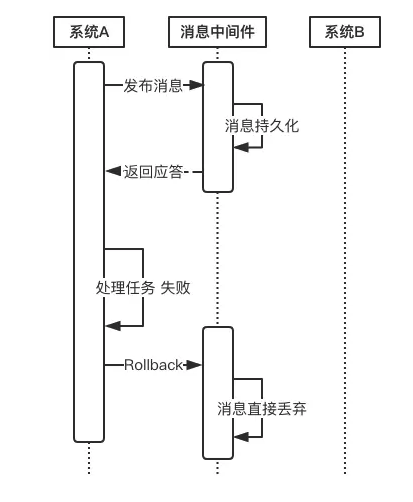
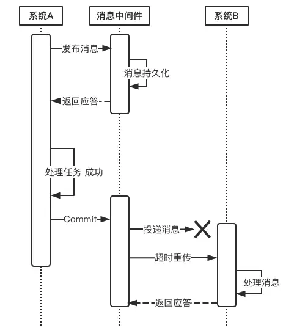

## 1. 数据库本地事务
### 1.1 ACID
说到数据库事务就不得不说，数据库事务中的四大特性，ACID:

A:原子性(Atomicity)

一个事务(transaction)中的所有操作，要么全部完成，要么全部不完成，不会结束在中间某个环节。事务在执行过程中发生错误，会被回滚（Rollback）到事务开始前的状态，就像这个事务从来没有执行过一样。
就像你买东西要么交钱收货一起都执行，要么要是发不出货，就退钱。

C:一致性(Consistency)

事务的一致性指的是在一个事务执行之前和执行之后数据库都必须处于一致性状态。如果事务成功地完成，那么系统中所有变化将正确地应用，系统处于有效状态。如果在事务中出现错误，那么系统中的所有变化将自动地回滚，系统返回到原始状态。

I:隔离性(Isolation)

指的是在并发环境中，当不同的事务同时操纵相同的数据时，每个事务都有各自的完整数据空间。由并发事务所做的修改必须与任何其他并发事务所做的修改隔离。事务查看数据更新时，数据所处的状态要么是另一事务修改它之前的状态，要么是另一事务修改它之后的状态，事务不会查看到中间状态的数据。
打个比方，你买东西这个事情，是不影响其他人的。

D:持久性(Durability)

指的是只要事务成功结束，它对数据库所做的更新就必须永久保存下来。即使发生系统崩溃，重新启动数据库系统后，数据库还能恢复到事务成功结束时的状态。

其中，mysql的隔离性为//todo

### 1.2 InnoDB实现原理
InnoDB是mysql的一个存储引擎，大部分人对mysql都比较熟悉，这里简单介绍一下数据库事务实现的一些基本原理，在本地事务中，服务和资源在事务的包裹下可以看做是一体的:

我们的本地事务由资源管理器进行管理:

而事务的ACID是通过InnoDB日志和锁来保证。事务的隔离性是通过数据库锁的机制实现的，持久性通过redo log（重做日志）来实现，原子性和一致性通过Undo log来实现。UndoLog的原理很简单，为了满足事务的原子性，在操作任何数据之前，首先将数据备份到一个地方（这个存储数据备份的地方称为UndoLog）。然后进行数据的修改。如果出现了错误或者用户执行了ROLLBACK语句，系统可以利用Undo Log中的备份将数据恢复到事务开始之前的状态。

和Undo Log相反，RedoLog记录的是新数据的备份。在事务提交前，只要将RedoLog持久化即可，不需要将数据持久化。当系统崩溃时，虽然数据没有持久化，但是RedoLog已经持久化。系统可以根据RedoLog的内容，将所有数据恢复到最新的状态。
对具体实现过程有兴趣的同学可以去自行搜索扩展。

### 1.3数据库的四种隔离级别
数据库一共有如下四种隔离级别：

Read uncommitted 读未提交
在该级别下，一个事务对一行数据修改的过程中，不允许另一个事务对该行数据进行修改，但允许另一个事务对该行数据读。
因此本级别下，不会出现更新丢失，但会出现脏读、不可重复读。

Read committed 读提交
在该级别下，未提交的写事务不允许其他事务访问该行，因此不会出现脏读；但是读取数据的事务允许其他事务的访问该行数据，因此会出现不可重复读的情况。

Repeatable read 重复读
在该级别下，读事务禁止写事务，但允许读事务，因此不会出现同一事务两次读到不同的数据的情况（不可重复读），且写事务禁止其他一切事务。

Serializable 序列化
该级别要求所有事务都必须串行执行，因此能避免一切因并发引起的问题，但效率很低。

隔离级别越高，越能保证数据的完整性和一致性，但是对并发性能的影响也越大。对于多数应用程序，可以优先考虑把数据库系统的隔离级别设为Read Committed。它能够避免脏读取，而且具有较好的并发性能。尽管它会导致不可重复读、幻读和第二类丢失更新这些并发问题，在可能出现这类问题的个别场合，可以由应用程序采用悲观锁或乐观锁来控制。

## 2.分布式事务

### 2.1 什么是分布式事务
分布式事务就是指事务的参与者、支持事务的服务器、资源服务器以及事务管理器分别位于不同的分布式系统的不同节点之上。简单的说，就是一次大的操作由不同的小操作组成，这些小的操作分布在不同的服务器上，且属于不同的应用，分布式事务需要保证这些小操作要么全部成功，要么全部失败。本质上来说，分布式事务就是为了保证不同数据库的数据一致性。

### 2.2 分布式事务产生的原因
从上面本地事务来看，我们可以看为两块，一个是service产生多个节点，另一个是resource产生多个节点。

**service多个节点**

随着互联网快速发展，微服务，SOA等服务架构模式正在被大规模的使用，举个简单的例子，一个公司之内，用户的资产可能分为好多个部分，比如余额，积分，优惠券等等。在公司内部有可能积分功能由一个微服务团队维护，优惠券又是另外的团队维护

这样的话就无法保证积分扣减了之后，优惠券能否扣减成功。

**resource多个节点**

同样的，互联网发展得太快了，我们的Mysql一般来说装千万级的数据就得进行分库分表，对于一个支付宝的转账业务来说，你给的朋友转钱，有可能你的数据库是在北京，而你的朋友的钱是存在上海，所以我们依然无法保证他们能同时成功。

### 2.3 分布式事务的基础
从上面来看分布式事务是随着互联网高速发展应运而生的，这是一个必然的我们之前说过数据库的ACID四大特性，已经无法满足我们分布式事务，这个时候又有一些新的大佬提出一些新的理论:

**CAP**
CAP定理，又被叫作布鲁尔定理。对于设计分布式系统来说(不仅仅是分布式事务)的架构师来说，CAP就是你的入门理论。

C (一致性):对某个指定的客户端来说，读操作能返回最新的写操作。对于数据分布在不同节点上的数据上来说，如果在某个节点更新了数据，那么在其他节点如果都能读取到这个最新的数据，那么就称为强一致，如果有某个节点没有读取到，那就是分布式不一致。

A (可用性)：非故障的节点在合理的时间内返回合理的响应(不是错误和超时的响应)。可用性的两个关键一个是合理的时间，一个是合理的响应。合理的时间指的是请求不能无限被阻塞，应该在合理的时间给出返回。合理的响应指的是系统应该明确返回结果并且结果是正确的，这里的正确指的是比如应该返回50，而不是返回40。

P (分区容错性):当出现网络分区后，系统能够继续工作。打个比方，这里个集群有多台机器，有台机器网络出现了问题，但是这个集群仍然可以正常工作。

熟悉CAP的人都知道，三者不能共有，如果感兴趣可以搜索CAP的证明，在分布式系统中，网络无法100%可靠，分区其实是一个必然现象，如果我们选择了CA而放弃了P，那么当发生分区现象时，为了保证一致性，这个时候必须拒绝请求，但是A又不允许，所以分布式系统理论上不可能选择CA架构，只能选择CP或者AP架构。

对于CP来说，放弃可用性，追求一致性和分区容错性，我们的zookeeper其实就是追求的强一致。

对于AP来说，放弃一致性(这里说的一致性是强一致性)，追求分区容错性和可用性，这是很多分布式系统设计时的选择，后面的BASE也是根据AP来扩展。

顺便一提，CAP理论中是忽略网络延迟，也就是当事务提交时，从节点A复制到节点B，但是在现实中这个是明显不可能的，所以总会有一定的时间是不一致。同时CAP中选择两个，比如你选择了CP，并不是叫你放弃A。因为P出现的概率实在是太小了，大部分的时间你仍然需要保证CA。就算分区出现了你也要为后来的A做准备，比如通过一些日志的手段，是其他机器回复至可用。

**BASE**
BASE 是 Basically Available(基本可用)、Soft state(软状态)和 Eventually consistent (最终一致性)三个短语的缩写。是对CAP中AP的一个扩展

基本可用:分布式系统在出现故障时，允许损失部分可用功能，保证核心功能可用。

软状态:允许系统中存在中间状态，这个状态不影响系统可用性，这里指的是CAP中的不一致。

最终一致:最终一致是指经过一段时间后，所有节点数据都将会达到一致。

BASE解决了CAP中理论没有网络延迟，在BASE中用软状态和最终一致，保证了延迟后的一致性。BASE和 ACID 是相反的，它完全不同于ACID的强一致性模型，而是通过牺牲强一致性来获得可用性，并允许数据在一段时间内是不一致的，但最终达到一致状态。

**酸碱平衡**
ACID能够保证事务的强一致性，即数据是实时一致的。这在本地事务中是没有问题的，在分布式事务中，强一致性会极大影响分布式系统的性能，因此分布式系统中遵循BASE理论即可。但分布式系统的不同业务场景对一致性的要求也不同。如交易场景下，就要求强一致性，此时就需要遵循ACID理论，而在注册成功后发送短信验证码等场景下，并不需要实时一致，因此遵循BASE理论即可。因此要根据具体业务场景，在ACID和BASE之间寻求平衡。

## 3.分布式事务解决方案
在说方案之前，首先你一定要明确你是否真的需要分布式事务？
上面说过出现分布式事务的两个原因，其中有个原因是因为微服务过多。我见过太多团队一个人维护几个微服务，太多团队过度设计，搞得所有人疲劳不堪，而微服务过多就会引出分布式事务，这个时候我不会建议你去采用下面任何一种方案，而是请把需要事务的微服务聚合成一个单机服务，使用数据库的本地事务。因为不论任何一种方案都会增加你系统的复杂度，这样的成本实在是太高了，千万不要因为追求某些设计，而引入不必要的成本和复杂度。
如果你确定需要引入分布式事务可以看看下面几种常见的方案。

### 3.1 2PC 两阶段提交事务
说到2PC就不得不聊数据库分布式事务中的 XA Transactions。

第一阶段：事务管理器要求每个涉及到事务的数据库预提交(precommit)此操作，并反映是否可以提交.

第二阶段：事务协调器要求每个数据库提交数据，或者回滚数据。

优点： 尽量保证了数据的强一致，实现成本较低，在各大主流数据库都有自己实现，对于MySQL是从5.5开始支持。

缺点:

单点问题:事务管理器在整个流程中扮演的角色很关键，如果其宕机，比如在第一阶段已经完成，在第二阶
段正准备提交的时候事务管理器宕机，资源管理器就会一直阻塞，导致数据库无法使用。

同步阻塞:在准备就绪之后，资源管理器中的资源一直处于阻塞，直到提交完成，释放资源。

数据不一致:两阶段提交协议虽然为分布式数据强一致性所设计，但仍然存在数据不一致性的可能，比如在第二阶段中，假设协调者发出了事务commit的通知，但是因为网络问题该通知仅被一部分参与者所收到并执行了commit操作，其余的参与者则因为没有收到通知一直处于阻塞状态，这时候就产生了数据的不一致性。

### 3.2 TCC

### 3.3 本地消息表 

### 3.4 MQ事务

### 3.5 Saga事务

### 3.6 基于消息服务的分布式事务
这种实现分布式事务的方式需要通过消息中间件来实现。假设有A和B两个系统，分别可以处理任务A和任务B。此时系统A中存在一个业务流程，需要将任务A和任务B在同一个事务中处理。下面来介绍基于消息中间件来实现这种分布式事务。

在系统A处理任务A前，首先向消息中间件发送一条消息
消息中间件收到后将该条消息持久化，但并不投递。此时下游系统B仍然不知道该条消息的存在。
消息中间件持久化成功后，便向系统A返回一个确认应答；
系统A收到确认应答后，则可以开始处理任务A；
任务A处理完成后，向消息中间件发送Commit请求。该请求发送完成后，对系统A而言，该事务的处理过程就结束了，此时它可以处理别的任务了。
但commit消息可能会在传输途中丢失，从而消息中间件并不会向系统B投递这条消息，从而系统就会出现不一致性。这个问题由消息中间件的事务回查机制完成，下文会介绍。
消息中间件收到Commit指令后，便向系统B投递该消息，从而触发任务B的执行；
当任务B执行完成后，系统B向消息中间件返回一个确认应答，告诉消息中间件该消息已经成功消费，此时，这个分布式事务完成。

**上述过程可以得出如下几个结论：**

1.消息中间件扮演者分布式事务协调者的角色。

2.系统A完成任务A后，到任务B执行完成之间，会存在一定的时间差。在这个时间差内，整个系统处于数据不一致的状态，但这短暂的不一致性是可以接受的，因为经过短暂的时间后，系统又可以保持数据一致性，满足BASE理论。

上述过程中，如果任务A处理失败，那么需要进入回滚流程，如下图所示：

若系统A在处理任务A时失败，那么就会向消息中间件发送Rollback请求。和发送Commit请求一样，系统A发完之后便可以认为回滚已经完成，它便可以去做其他的事情。
消息中间件收到回滚请求后，直接将该消息丢弃，而不投递给系统B，从而不会触发系统B的任务B。

**此时系统又处于一致性状态，因为任务A和任务B都没有执行。**

上面所介绍的Commit和Rollback都属于理想情况，但在实际系统中，Commit和Rollback指令都有可能在传输途中丢失。那么当出现这种情况的时候，消息中间件是如何保证数据一致性呢？——答案就是超时询问机制。

系统A除了实现正常的业务流程外，还需提供一个事务询问的接口，供消息中间件调用。当消息中间件收到一条事务型消息后便开始计时，如果到了超时时间也没收到系统A发来的Commit或Rollback指令的话，就会主动调用系统A提供的事务询问接口询问该系统目前的状态。该接口会返回三种结果：

- 提交 若获得的状态是“提交”，则将该消息投递给系统B。

- 回滚 若获得的状态是“回滚”，则直接将条消息丢弃。

- 处理中 若获得的状态是“处理中”，则继续等待。

下面来说一说消息投递过程的可靠性保证。
当上游系统执行完任务并向消息中间件提交了Commit指令后，便可以处理其他任务了，此时它可以认为事务已经完成，接下来消息中间件**一定会保证消息被下游系统成功消费掉！**那么这是怎么做到的呢？这由消息中间件的投递流程来保证。

消息中间件向下游系统投递完消息后便进入阻塞等待状态，下游系统便立即进行任务的处理，任务处理完成后便向消息中间件返回应答。消息中间件收到确认应答后便认为该事务处理完毕！

如果消息在投递过程中丢失，或消息的确认应答在返回途中丢失，那么消息中间件在等待确认应答超时之后就会重新投递，直到下游消费者返回消费成功响应为止。当然，一般消息中间件可以设置消息重试的次数和时间间隔，比如：当第一次投递失败后，每隔五分钟重试一次，一共重试3次。如果重试3次之后仍然投递失败，那么这条消息就需要人工干预。

这就涉及到整套分布式事务系统的实现成本问题。
我们知道，当系统A将向消息中间件发送Commit指令后，它便去做别的事情了。如果此时消息投递失败，需要回滚的话，就需要让系统A事先提供回滚接口，这无疑增加了额外的开发成本，业务系统的复杂度也将提高。对于一个业务系统的设计目标是，在保证性能的前提下，最大限度地降低系统复杂度，从而能够降低系统的运维成本。

## 4. mysql XA分布式事务支持

https://www.jianshu.com/p/c2d8f2bbcb6f 

性能损失较大
