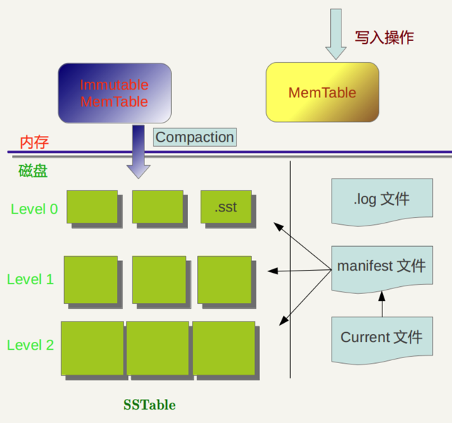
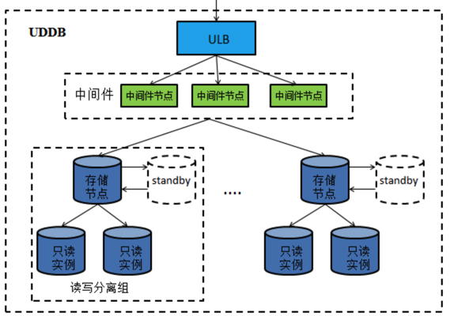

## 1.主流数据库的比较

**mysql**

关系型数据库。

无论数据还是索引都存放在硬盘中。到要使用的时候才交换到内存中。能够处理远超过内存总量的数据。

在不同的引擎上有不同 的存储方式。//可拔插式存储引擎

查询语句是使用传统的 SQL 语句，拥有较为成熟的体系，成熟度很高。

默认Innodb引擎底层实现为B+树

**mongo**

MongoDB能处理的规模和Mysql类似，对于非结构化的数据处理友好。

MongoDB 将数据存储为一个文档，数据结构由键值(key=>value)对组成。MongoDB 文档类似于 JSON 对象。字段值可以包含其他文档，数组及文档数组。

天然对分布式数据库的支持，对事务的支持较弱

使用WiredTiger作为默认的存储引擎，WiredTiger引擎底层实现为B树

关于mysql与mongo存储引擎实现差异 相关扩展[为什么mongo使用B树](https://mp.weixin.qq.com/s/ieGfv66GstJC2cltiE_c5g)

**redis**

它就是一个不折不扣的内存数据库。

持久化方式：

Redis 所有数据都是放在内存中的，持久化是使用 RDB 方式或者 aof 方式。

注：aof RDB 为两种redis快照方式 相关扩展：[redis快照为什么不会阻塞其他请求](https://mp.weixin.qq.com/s/PJ1-D9XK3pd7fWUUpm4FyQ)

**RDB的快照、AOF的重写都需要fork，这是一个重量级操作，会对Redis造成阻塞**

一般操作是redis当作缓存使用，同时如果读取失败配合持久化db进行读取：


```
function getUser(String userId) User {
  User user = redis.get(userId);
  if user == null {
    user = db.get(userId);
    if user != null {
      redis.set(userId, user);
    }
  }
  return user;
}

function updateUser(String userId, User user) {
  db.update(userId, user);
  redis.expire(userId);
}
```


**LevelDB**

kv 数据库，写性能好，读性能较弱

底层通过LSM树来实现，但LSM树是一种数据结构，但不是传统数据结构上我们所定义的“树”

leveldb的架构参考：



为更好理解，可参考：

[由LevelDB理解LSM树](https://blog.csdn.net/Double2hao/article/details/90107904)

leveldb与redis： [既生 Redis 何生 LevelDB ？](https://zhuanlan.zhihu.com/p/53299778)

**couchdb**

是一个文档数据库，CouchDB 相对其他 NoSQL 存储有一个很大的特点，就是他的索引是惰性创建的。

CouchDB 中有一个view的概念，view可以理解为数据索引，在你没有访问这个view时，数据写入都是直接按唯一id做的类似于key-value的存储，而在访问这个view时，view中的map/reduce 方法会按条件对key-value的数据进行按条件的索引建立，下次再访问view时就只需要在内存中获取即可，当文档有更新时，view也是增量更新的。这也使得CouchDB 的索引管理非常灵活。

couchdb视图由B树实现，即在每次查询的时候进行视图的更新，在写的时候不会主动更新视图，可用于实时性要求不高的场景。可以通过_change配置进行实时监控，批量写入。

相关文档参考[CouchDB 视图简介及增量更新视图的方法](https://www.ibm.com/developerworks/cn/opensource/os-cn-couchdb-view-change/index.html)


## 2. 高性能的理解

增大负载能力，缩短查询时间，在同等时间完成尽可能多的业务处理

通用的分布式数据库架构：




## 3.单机数据库的性能因素

1.并发。为增加数据库单位时间的处理事务能力，数据库引入并发事务，同时引出了并发问题，为解决并发问题，引出了三种常见的并发控制机制（悲观锁，乐观锁，MVCC）


可参考[浅谈数据库并发机制](https://draveness.me/database-concurrency-control)

个人总结链接 [数据库并发机制](./数据库并发机制.md)

2.索引。为提高读性能，数据库引入索引，以牺牲写性能为代价。
  （mysql使用的是B+树，为了减少遍历查询对磁盘的io操作，  mongo使用的是B树，虽然遍历数据的查询是相对常见的，但是 MongoDB 认为查询单个数据记录远比遍历数据更加常见，由于 B 树的非叶结点也可以存储数据，所以查询一条数据所需要的平均随机 IO 次数会比 B+ 树少，使用 B 树的 MongoDB 在类似场景中的查询速度就会比 MySQL 快。）

3.WAL机制（writing-ahead-log），大部分数据库都会使用该机制，在我们更改/插入数据的时候，把提交的事务先写入日志中（序列写），在空闲的时候日志进行随机写达到持久化。

4.使用场景。根据具体业务的读写比例，不同数据类型 进行数据库选型。


## 3. 分布式数据库达到高性能的手段

1.对数据进行分片 （分库分表）

2.对服务的故障检测与监控，对磁盘故障的恢复，主备切换做到高可用

3.对数据分布的处理增加服务处理的吞吐

4.硬件设备的性能保障（cpu，内存，磁盘）

5.对分布式事务的处理优化 ，可参考[分布式事务及分布式事务解决方案](https://juejin.im/post/5b5a0bf9f265da0f6523913b)


## 4.分片及其策略

参考[数据库分片策略](./database分片策略.md)


## 5.分布式事务


参考[分布式事务](./分布式事务.md)


## 6.主流分布式数据库

1.主流的OLAP（数据仓库），分析数据，海量数据，读多写少，数据分片形式存储，我们通过增加冗余，减少分布式事务的复杂度来提升效率

//OLAP（On-line Analytical Processing，联机分析处理）

2.Google Spanner为代表的 shared nothing 的架构，自动分片，分布式事务，弹性性能，类似的有TiDB、CockroachDB、OceanBase

//shared nothing 就是各个处理单元都有各自私有的cpu，内存，和磁盘系统

3.亚马逊Auraro 主要思想是计算和存储分离架构，使用共享存储技术，这样就提高了容灾和总容量的扩展。但是在协议层，只要是不涉及到存储的部分，本质还是单机实例的 MySQL，不涉及分布式存储和分布式计算，这样就和 MySQL 兼容性非常高。（没有了解）

4.BigTable, Google公司的一个稀疏的、分布式的、多维持久有序哈希数据库。·hash分片策略和表的周期性压缩，可以参考[Bigtable 和 LevelDB 的设计与实现](https://mp.weixin.qq.com/s/9QEuDHtGyogvXj1ycubwDg)


