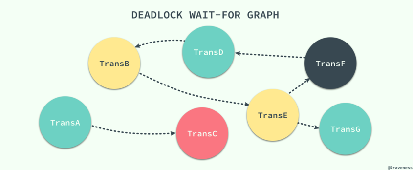
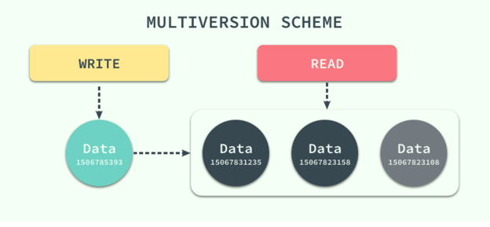

## 并发的产生以及控制并发的必要性

如果数据库中的所有事务都是串行执行的，那么它容易成为整个应用的性能瓶颈，虽然说没法水平扩展的节点在最后都会成为瓶颈，但是串行执行事务的数据库会加速这一过程，而并发使一切事情的发生都成为了可能，它能够解决一定的性能问题，但是它会带来更多诡异的错误。引入了并发事务之后，如果不对事务的执行进行控制就会出现各种各样的问题，你可能没有享受到并发带来的性能提升就已经被各种奇怪的问题折磨的欲仙欲死了。

## 三种常见的并发控制机制

悲观并发控制：悲观锁，在我们操作前后加入锁

乐观并发控制：乐观锁，

多版本并发控制：MVCC，与前两者对立的命名不同，MVCC 可以与前两者中的任意一种机制结合使用，以提高数据库的读性能。

## 悲观并发控制

**读写锁**

**两阶段锁协议 2PL**

两阶段锁协议（2PL）是一种能够保证事务可串行化的协议，它将事务的获取锁和释放锁划分成了增长（Growing）和缩减（Shrinking）两个不同的阶段。

growing --> shrinking

growing阶段，一个事务只能获得锁但是不能释放锁

shrinking阶段，一个事务只能释放锁不能获得锁

但是引入了一个严重的问题，死锁

**死锁的处理**

1) 从源头杜绝死锁的产生和出现

解决方法：
a.保证事务之间的等待不会出现环，也就是事务之间的等待图应该是一张有向无环图，没有循环的等待/一个事务中想要获得的所有资源都在事务开始时以原子的方式被锁定，所有的资源要么被锁定要么都不被锁定。会出现两个问题：

1）[事务一开始很难判断哪些资源需要锁定](todo,why)；2）因为有一些很晚才会使用的数据提前被锁定，数据的利用率与事务的并发率也会非常低，

针对2）问题按照一定的顺序为所有行加锁，同时与2PL协议结合，在加锁阶段保证所有的数据行都是从小到大一次进行加锁的，不过这种方式依然需要事务提前知道将要加锁的数据集。

b.另一种预防死锁的方式是使用抢占事务回滚的方式预防死锁.有两种机制，wait-die机制，wound-wait机制。

注：wait-die机制与wound-wait机制详情：

|                       | wait-die | wound-wait |
| --------------------- | -------- | ---------- |
| Ti is younger than Tj | Ti dies  | Ti waits   |
| Ti is older than Tj   | Ti waits | Tj aborts  |

c.事务设置超时，但是需要谨慎，耗时较长的事务无法正常执行

2）允许系统进入死锁的状态，但是在系统出现死锁时能够及时发现并且进行恢复。

如果数据库程序无法通过协议从原理上保证死锁不会发生，那么就需要在死锁发生时及时检测到并从死锁状态恢复到正常状态保证数据库程序可以正常工作。使用检测和恢复的方式解决死锁时，数据库程序需要维护数据和事务之间的引用信息，同时也需要提供一个用于判断当前数据库是否进入死锁状态的算法，最后需要在死锁发生时提供合适的策略及时恢复。（维护数据和事务的应用信息，判断死锁算法，算法恢复策略）

如上图，在有向图中出现了环，说明当前数据库进入了死锁状态 TransB -> TransE -> TransF -> TransD -> TransB，这时候死锁恢复机制介入了。

从死锁恢复的解决办法就是选择整个环中一个事务进行回滚，以打破等待途中的环，在选择回滚事务的时候要考虑 最小化代价

**锁的粒度**

当我们拥有不同粒度的锁之后，如果某个事务想要锁定整个数据库或者整张表时只需要简单的锁住对应的节点就会在当前节点加上显示（explicit）锁，在所有的子节点上加隐式（implicit）锁，可以解决父节点被加锁时，子节点不能被加锁的问题。但是我们没有办法在子节点被加锁时，立刻确定父节点不能被加锁。

//todo 意向锁

## 乐观并发控制 

先介绍基于时间戳的并发控制机制，然后在这个协议的基础上进行扩展，实现乐观的并发控制机制

**基于时间戳的并发控制机制**

锁协议按照不同事务对同一数据项请求的时间一次进行，因为后面执行的事务想要获取的数据已被前面的事务加锁，只能等待锁的释放，所以基于锁的协议执行事务的顺序与获得锁的顺序相关。

在这里想要介绍的基于时间戳的协议能够在事务执行之前决定事务的执行顺序

每一个事务都会具有一个全局唯一的时间戳，它既可以使用系统的时钟时间，也可以使用计数器，只要能够保证所有的时间戳都是唯一并且随时间递增就可以。

无论是读操作还是写操作都会从左到右依次比较读写时间戳的值，如果小于当前值就会直接被拒绝然后回滚，数据库系统会给回滚的事务添加一个新的时间戳并重新执行这个事务。

**基于验证的协议**

验证协议根据事务的只读或者更新将所有事务执行分为两到三个阶段：

Read Phase -> Validation Phase (abort) -> Write Phase 

## 多版本并发控制

之前的并发控制机制是通过延迟/终止 相应的事务来解决事务之间的竞态条件 race condition 来保证事务的可串行化，前面两种机制确实可以从根本上解决并发事务的可串行化问题。

但是实际环境中，数据库的事务大都是只读的，读请求对应写请求的很多倍，如果写请求和读请求之前没有并发控制机制，那么最坏的情况也是读请求读到了已经写入的数据，这对很多应用都是可以接收的。

在这种大前提下，数据库引入了另一种并发控制 --- 多版本并发控制 multiversion concurrency control

每一个写操作都会创建一个新版本的数据，读操作会从有限多个版本的数据中挑选一个最合适的结果直接返回。此时读写操作之间的冲突就不再需要被关注，而管理和快速挑选版本就成了MVCC需要解决的主要问题。

MVCC并不是一个与乐观锁悲观锁对立的并发控制机制，它可以与两者很好的结合。

## Mysql与MVCC

2PL与 MVCC 结合

隔离级别是一种在并发性能和并发产生的副作用间的妥协。实现隔离机制需要 1）锁机制  2）MVCC

[MySQL InnoDB MVCC 机制的原理及实现](https://zhuanlan.zhihu.com/p/64576887) 比较详尽

[MYSQL MVCC 实现原理](https://www.jianshu.com/p/f692d4f8a53e) 比较简单容易理解

## PostgreSQL与MVCC

乐观锁 MVCC

## refer 

[数据库并发处理机制](https://draveness.me/database-concurrency-control)

[MYSQL MVCC 实现原理](https://www.jianshu.com/p/f692d4f8a53e)

[轻松理解 MYSQL MVCC实现机制](https://blog.csdn.net/whoamiyang/article/details/51901888)

[MySQL InnoDB MVCC 机制的原理及实现](https://zhuanlan.zhihu.com/p/64576887)

//PostgreSQL todo what 